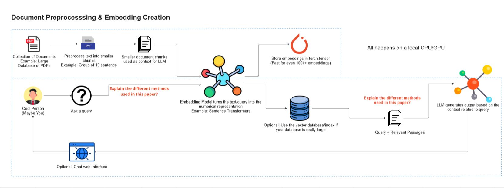

# ✈️ Air India RAG Chatbot

<p align="center">
  
  
  
  
  
</p>

> An **Retrieval-Augmented Generation (RAG)** chatbot tailored for Air India, leveraging **AWS Bedrock APIs** for natural language processing. The chatbot provides real-time customer support by answering queries about company and airline services using a knowledge base of Air India-related given documents.

<p align="center">
  
</p>

---

## 📋 Table of Contents

- [Overview](#overview)
- [System Architecture](#system-architecture)
- [What You Will Learn](#what-you-will-learn)
- [What You'll Build](#what-youll-build)
- [Tech Stack](#tech-stack)
- [Project Structure](#project-structure)
- [Getting Started](#getting-started)
  - [Prerequisites](#prerequisites)
  - [Installation](#installation)
  - [Configuration](#configuration)
  - [Running the App](#running-the-app)
- [Key Features](#key-features)
- [Contributing](#contributing)
- [License](#license)

---

## 🧾 Overview

An AI-powered **RAG chatbot** for Air India built with AWS Bedrock, LangChain, and Python. Provides real-time support for airline services using Retrieval-Augmented Generation.

- Ingests and processes Air India-related PDF documents
- Generates vector embeddings using AWS Bedrock's Titan Text Embeddings V2 model
- Stores embeddings in a vector database for efficient similarity search
- Retrieves relevant document chunks based on user queries
- Generates accurate, context-grounded answers using Nova Pro model
- Provides a user-friendly chat interface for real-time support

---

## 🏗️ System Architecture

> *High-level architecture overview of the Air India RAG Chatbot pipeline — from document ingestion and embedding creation to vector storage, retrieval, and LLM-powered response generation.*

### 🔄 Architecture Flow

```
Air India PDF Documents
     │
     v
[📄 PDF Ingestion]  (PyPDFLoader)
     │
     v
[✂️ Text Chunking]  (RecursiveCharacterTextSplitter | ~15 sentences each)
     │
     v
[🧠 Vector Embedding]  (AWS Bedrock Titan Text Embeddings V2)
     │
     v
[🗄️ Chroma Vector Store]  (Persistent vector database)
     │
     v
[🔍 User Query] → [Bedrock Embeddings] → [Top-K Chunks]
     │
     v
[🤖 LLM Generation]  (AWS Bedrock Nova Pro)
     │
     v
[✅ Grounded Answer] → [Streamlit UI]
```


### Architecture Breakdown

| Stage | Component | Description |
|-------|-----------|-------------|
| **1. Document Ingestion** | PyPDFLoader | Collection of Air India PDFs |
| **2. Text Preprocessing** | RecursiveCharacterTextSplitter | Split documents into smaller, meaningful chunks (~15 sentences each) |
| **3. Embedding Creation** | AWS Bedrock Titan text embedding V2 | Convert chunks into vector representations |
| **4. Vector Storage** | Chroma DB | Store and index embeddings for fast similarity lookup |
| **5. Query Processing** | Bedrock Embeddings | Convert user query into vector for similarity matching |
| **6. Retrieval** | Vector Search | Fetch top-K most relevant chunks |
| **7. LLM Generation** | Nova Pro | Generate grounded, context-aware response using retrieved chunks |
| **8. UI Interface** | Streamlit | Interactive chat interface for Air India customers |

---

## 🎓 What You Will Learn

- ✅ Mastering the use of **AWS Bedrock** for NLP tasks
- ✅ Implementing **Retrieval-Augmented Generation (RAG)** to enhance chatbot responses
- ✅ Building a real-time chatbot for **customer support** using AI
- ✅ Integrating a chatbot with an existing **knowledge base**
- ✅ Understanding the architecture of **cloud-based AI solutions**
- ✅ Working with **Chroma DB** as a vector store for document retrieval
- ✅ Building a **PDF ingestion pipeline** with LangChain document loaders

---

## 🛠️ What You'll Build

- A functional **Air India Chat Assistant**
- An **information retrieval system** connected to the chatbot
- An **AI model integrated with AWS Bedrock**
- A **user interface** for interacting with the chatbot

---

## 🧰 Tech Stack

| Technology | Purpose |
|-----------|----------|
| **Python 3.10+** | Core programming language |
| **LangChain** | RAG pipeline orchestration |
| **AWS Bedrock** | Foundation LLM & Embeddings (Nova Pro & Titan text embedding V2) |
| **Chroma DB** | Vector database for similarity search |
| **Boto3** | AWS SDK for Python |
| **PyPDFLoader** | PDF document parsing |
| **Streamlit** | Chat user interface |
| **dotenv** | Environment variable management |

---

## 📁 Project Structure

```
Air-India-RAG-Chatbot/
├── AirIndia_Rag_Chatbot/
│   ├── AirIndia/                  # Air India PDF knowledge base
│   │   ├── Aiesl Employees service regulation.pdf
│   │   ├── Air India Fact Sheet.pdf
│   │   ├── Domestic Routes Feb 2025.pdf
│   │   ├── International Routes Feb 2025.pdf
│   │   └── List of Major Air India Disasters.pdf
│   ├── chroma_vectorestore/       # Chroma vector store (auto-generated)
│   │   ├── 5b2c7491-.../            # Vector index data
│   │   └── chroma.sqlite3           # SQLite metadata store
│   ├── images/                    # App images/assets
│   ├── .gitignore
│   ├── app.py                     # Streamlit chat interface
│   ├── main.py                    # Entry point / RAG pipeline & document ingestion
│   └── test.py                    # Unit tests
├── images/                        # Project images
│   └── Air_India.JPG
├── .gitignore                     # Git ignore rules
├── LICENSE                        # MIT License
├── pyproject.toml                 # Project metadata & dependencies
├── uv.lock                        # Lockfile for uv package manager
└── README.md                      # Project documentation
```

---

## 🚀 Getting Started

### Prerequisites

- Python 3.10 or higher
- AWS Account with Bedrock access enabled
- AWS CLI configured with appropriate IAM permissions
- Git

### Installation

1. **Clone the repository**
```bash
git clone https://github.com/Vishalkumarjaiswal16/Air-India-RAG-Chatbot.git
cd Air-India-RAG-Chatbot
```

2. **Create a virtual environment**
```bash
python -m venv venv
source venv/bin/activate  # On Windows: venv\Scripts\activate
```

3. **Install dependencies**
```bash
pip install -r requirements.txt
```

### Configuration

1. **Copy the environment template**
```bash
cp .env.example .env
```

2. **Fill in your AWS credentials in `.env`**
```env
AWS_ACCESS_KEY_ID=your_access_key
AWS_SECRET_ACCESS_KEY=your_secret_key
AWS_DEFAULT_REGION=us-east-1
```

### Running the App

1. **Ingest documents into the vector store**
```bash
python AirIndia_Rag_Chatbot/main.py
```

2. **Launch the Streamlit chatbot UI**
```bash
streamlit run AirIndia_Rag_Chatbot/app.py
```

3. Open your browser at `http://localhost:8501`

---

## ✨ Key Features

- 🔍 **Semantic Search** — Finds the most relevant Air India documents using vector similarity
- 🤖 **LLM-Powered Responses** — Uses state-of-the-art foundation models via AWS Bedrock
- 📄 **Document Grounded** — Answers are always backed by real Air India documents
- ⚡ **Real-time Support** — Low latency responses for customer queries
- 🖥️ **Interactive UI** — Clean Streamlit-based chat interface
- ☁️ **Cloud-Native** — Fully powered by AWS services
- 🔒 **Private & Secure** — All data stays within your AWS account

---

## 🤝 Contributing

Contributions are welcome! Please follow these steps:

1. Fork the repository
2. Create a new branch (`git checkout -b feature/your-feature`)
3. Commit your changes (`git commit -m 'Add your feature'`)
4. Push to the branch (`git push origin feature/your-feature`)
5. Open a Pull Request

---

## 📄 License

This project is licensed under the MIT License — see the [LICENSE](LICENSE) file for details.

---

Made with ❤️ by [Vishal Kumar](https://github.com/Vishalkumarjaiswal16)
